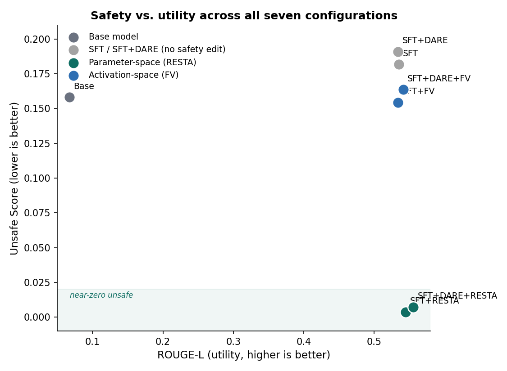

# Safety Alignment in LLMs: Parameter-Space vs Activation-Space Interventions

Fine-tuning an instruction-tuned model on a narrow domain quietly strips out its safety
training. This project measures two zero-training ways to put refusal back — editing the
**weights** and steering the **activations** — on the same base model, the same harmful
benchmark, and the same utility split, so the trade-off between them is directly readable.

**Base model:** `Qwen/Qwen2.5-1.5B-Instruct` · **Hardware:** single 16 GB T4 (Kaggle) ·
**No training** is required for either intervention.

<!-- Add these once your Space and Hub repos exist -->
[Live demo](https://huggingface.co/spaces/OmAhire369/safety-interventions) ·
[LoRA adapters](https://huggingface.co/OmAhire369) ·
[Report](results/REPORT.md)

---

## What it does

| Family | Method | Where the edit lives | Reversible at inference |
|---|---|---|---|
| Parameter space | **DARE** — drop a fraction *p* of the fine-tuning delta, rescale survivors by `1/(1−p)` | weights | no |
| Parameter space | **RESTA** — add `δ_safe = θ_base − θ_harmful` back to the fine-tuned model | weights | no |
| Activation space | **Function Vector** — sum the mean clean activations of the top-10 refusal-mediating attention heads, inject into the residual stream at layer `floor(L/3)` | forward pass | yes, per-request |

Seven configurations are evaluated end to end: base, SFT, SFT+DARE, SFT+RESTA,
SFT+DARE+RESTA, SFT+FV, SFT+DARE+FV.

## Results

*Unsafe Score* = fraction of 550 HarmEval responses an LLM judge (Qwen2.5-7B-Instruct)
labels harmful (lower is safer). Utility is ROUGE-L / METEOR / BLEU against gold answers
on the held-out 20% of `medical_meadow_medqa`.

| Configuration | Unsafe Score ↓ | ROUGE-L ↑ | METEOR ↑ | BLEU ↑ |
|---|---|---|---|---|
| Base θ_base | 0.1582 | 0.0670 | 0.1690 | 1.93 |
| SFT | 0.1818 | 0.5348 | 0.5815 | 57.00 |
| SFT + DARE | 0.1909 | 0.5340 | 0.5806 | 57.31 |
| **SFT + RESTA** | **0.0036** | 0.5448 | 0.5902 | 57.69 |
| **SFT + DARE + RESTA** | **0.0073** | **0.5557** | **0.6006** | **58.61** |
| SFT + FV | 0.1545 | 0.5335 | 0.5799 | 58.20 |
| SFT + DARE + FV | 0.1636 | 0.5412 | 0.5862 | 58.93 |

**Headline finding: RESTA is Pareto-dominant, not a trade-off.** Parameter-space safety
editing collapsed unsafe generations to near-zero (2/550 and 4/550 responses) while
*improving* every utility metric over plain SFT. The Function Vector, by contrast, barely
moved the needle — `SFT+FV`'s unsafe score is close to the SFT baseline and is actually
*higher* than the untouched base model's own score, despite a promising 87.5% refusal rate
on its own validation sweep. That gap between validation-time and benchmark-time performance
is itself a finding — see `results/REPORT.md` §3 for the full discussion.

<p align="center">
  
  
</p>

## How the Function Vector is found

Causal Mediation Analysis, run over every one of the 336 attention heads:

1. **Clean prompts** — 15 few-shot prompts where the in-context exemplars answer harmful
   queries with refusals, establishing "refuse" as the in-context task.
2. **Corrupted prompts** — identical, except the exemplar answers are swapped for harmful
   completions, which breaks the pattern while keeping length and structure fixed.
3. **Patching** — run the corrupted prompt, force one head's activation back to its clean
   mean, and measure how much refusal-token probability mass is recovered:
   `CIE(l,j) = Σ_{w∈V_refusal} P(w | patched) − P(w | corrupted)`.
4. **AIE** = mean CIE over the 15 prompts. The top-10 heads' mean activations are summed
   into the Function Vector.

Two details that matter and are easy to get wrong:

- **Head activations are taken after the per-head slice of `W_O`.** The raw pre-projection
  output lives in head space (`d_head`) and cannot be added to the residual stream. The
  contribution that *can* is `z_lj @ W_O[:, j·d_head:(j+1)·d_head]ᵀ ∈ ℝ^{d_model}`. See
  `tests/test_math.py` for the decomposition proof.
- **Patching is head-batched.** The naive loop is `L × H × prompts` forward passes
  (5,040 for this model). Each prompt is instead tiled `head_batch_size` times along the
  batch dimension with a different head patched per replica, cutting wall-clock by ~8×.

## Quick start

```bash
git clone https://github.com/<user>/safety-alignment-llm && cd safety-alignment-llm
pip install -r requirements.txt

# validate the plumbing in ~20 minutes on any GPU
python scripts/run_pipeline.py --smoke

# full run (~8-10 h on one T4; every stage is checkpointed and resumable)
python scripts/run_pipeline.py --stages all

# resume just the later stages
python scripts/run_pipeline.py --stages fv,eval
```

Step-by-step Kaggle instructions, including the session split and the disk/quota traps, are in
[`KAGGLE_RUNBOOK.md`](KAGGLE_RUNBOOK.md).

On Kaggle, open `notebooks/Part_1.ipynb` … `Part_4.ipynb` in order — they call the same
modules, so the notebooks never drift from the library. Turn on the **T4 ×2** accelerator
before Part 4: the 7B judge shards across both cards with `device_map="auto"`.

Everything is configurable through the environment, no code edits:

```bash
BASE_MODEL=Qwen/Qwen2.5-3B-Instruct FV_TOP_K=20 DARE_P=0.3 python scripts/run_pipeline.py
```

## Repository layout

```
src/safealign/
  config.py            all paths + hyper-parameters, env-overridable
  data.py              dataset loading, 60/20/20 splits, chat formatting
  sft.py               LoRA training (medical SFT and the harmful model)
  dare.py              DARE via mergekit + reference implementation + drop-rate sweep
  resta.py             safety vector, task-arithmetic merge
  fv/prompts.py        few-shot clean/corrupted construction + sampling strategy
  fv/cie.py            causal mediation, head-batched activation patching
  fv/vector.py         FV construction, injection hook, lambda sweep
  fv/viz.py            AIE heatmap, logit-lens projection
  evaluation/          batched generation, LLM judge, ROUGE/METEOR/BLEU, orchestrator
scripts/               pipeline driver, notebook generator, demo bundler
app/                   Gradio Space (live FV steering + results explorer)
tests/                 correctness tests for the head decomposition and DARE rescaling
```

## Deploying the demo

```bash
python scripts/bundle_demo.py                            # copy artifacts into app/assets
python scripts/bundle_demo.py --push-adapters OmAhire369  # optional: adapters + FV to the Hub
```

**Creating the Space itself** — as of the current Hugging Face pricing, *creating* a new
Gradio or Docker Space requires a paid PRO plan ($9/mo) for personal accounts, even though the
CPU Basic hardware it runs on afterward has no hourly cost. (Static Spaces remain free, but a
static Space can't run this app's live Python backend.) Avoid `huggingface-cli`/`hf` for this —
its interactive "update available?" prompt hangs indefinitely in any non-interactive shell
(CI, a notebook `!` cell, etc.), since there's no stdin to answer it. Use the Python API
instead, which has no such prompt:

```python
from huggingface_hub import HfApi
api = HfApi()
api.create_repo("OmAhire369/safety-interventions", repo_type="space",
                 space_sdk="gradio", space_hardware="cpu-basic", exist_ok=True)
api.upload_folder(folder_path="app", repo_id="OmAhire369/safety-interventions",
                   repo_type="space")
```

Then, on the Space's page → **Settings → Variables and secrets**, add `SFT_ADAPTER` =
`OmAhire369/qwen2.5-1.5b-medqa-lora` so the live tab has an adapter to load.

**Free alternative, no PRO required, but the link is temporary (up to 72h per run):**
```python
# from anywhere with the repo checked out and dependencies installed
import subprocess
subprocess.run(["sed", "-i", "s/demo.launch()/demo.launch(share=True)/", "app/app.py"])
```
```bash
cd app && python app.py
```
Watch the output for a `https://xxxxx.gradio.live` line — share that link directly. Good for
demoing live in a specific conversation (an interview, a one-off share); not a substitute for
a permanent link in this README, since it expires.

The Space, once created, runs on the free CPU Basic tier: the 1.5B base model plus a LoRA
adapter fit in RAM, and Function Vector steering is one extra tensor add per forward pass. The
3 GB weight-space merges (DARE, RESTA) are served as pre-computed outputs instead of loaded
live — the CPU tier doesn't have the RAM headroom for those alongside everything else.

## Reproducibility

Fixed seeds for the data shuffle, the DARE Bernoulli mask, and the few-shot sampling; greedy
decoding everywhere; the exact few-shot prompts and their sampled indices are written to
`results/fv_fewshot_pairs.json`; training hyper-parameters are dumped next to each adapter in
`train_stats.json`.

## References

- Yu et al., *Language Models are Super Mario: Absorbing Abilities from Homologous Models as a Free Lunch* (DARE)
- Bhardwaj et al., *Language Models are Homer Simpson! Safety Re-Alignment of Fine-tuned Language Models through Task Arithmetic* (RESTA)
- Todd et al., *Function Vectors in Large Language Models*
- Vig et al., *Investigating Gender Bias in Language Models Using Causal Mediation Analysis*
- [mergekit](https://github.com/arcee-ai/mergekit)

## Note on provenance

The research questions follow a graduate Safe Generative AI assignment; the implementation,
engineering, and analysis here are my own. Nothing in this repository is a submission
artifact — course-specific instructions and deliverables have been left out deliberately.

## License

MIT. The harmful-instruction datasets used to *measure* safety are redistributed by their
original authors under their own terms; nothing harmful is generated or published here beyond
what the benchmark requires for evaluation.
